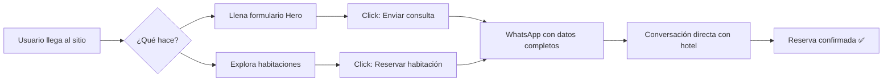

<p align="center">
  
  
  
  
  
</p>

# 🏨 Hotel Chavín – Barranca, Perú

Sitio web corporativo moderno para **Hotel Chavín**, diseñado para convertir visitantes en huéspedes a través de un flujo de reservas directo vía WhatsApp. Construido con Next.js 15, optimizado para SEO y rendimiento.

<p align="center">
  
</p>

## ✨ Features

- 🎯 **Reservas vía WhatsApp** – Formulario inteligente que envía datos del huésped directamente al chat del hotel
- 🏠 **Catálogo de habitaciones** – 4 tipos (Simple, Doble, Triple, Matrimonial) con CTAs contextuales
- 🖼️ **Galería con Lightbox** – Visualización ampliada de instalaciones con navegación por teclado
- 📱 **Widget WhatsApp flotante** – Chat expandible con mensaje de bienvenida, siempre visible
- 🔍 **SEO optimizado** – Meta tags, Open Graph, Twitter Cards, JSON-LD (Hotel + LocalBusiness)
- 🗺️ **Google Maps integrado** – Ubicación exacta embebida en el footer
- 🎨 **Design System corporativo** – Paleta dorada/navy con tipografía premium (Inter + Playfair Display)
- 📐 **100% Responsive** – Mobile-first con menú hamburguesa animado
- ⚡ **Rendimiento** – SSR, lazy loading, compilación < 5s

## 🛠️ Tech Stack

| Categoría | Tecnología |
|-----------|-----------|
| Framework | Next.js 15 (App Router, SSR) |
| UI | React 19 + TypeScript 5 |
| Estilos | Tailwind CSS 3.4 |
| Formularios | React Hook Form + Zod |
| Iconos | Lucide React |
| Fuentes | Google Fonts (Inter, Playfair Display) |
| SEO | Metadata API + JSON-LD Schema.org |

## 🚀 Quick Start

### Prerequisites

- Node.js >= 18
- npm

### Installation

```bash
git clone https://github.com/your-username/hotel-chavin.git
cd hotel-chavin
npm install
npm run dev
```

Abre [http://localhost:3000](http://localhost:3000) en tu navegador.

## 📁 Project Structure

```
src/
├── app/
│   ├── layout.tsx          # Root layout + SEO + JSON-LD
│   ├── page.tsx            # Composición de secciones
│   └── globals.css         # Design system (tokens, components)
├── components/
│   ├── Header.tsx          # Nav sticky con scroll transitions
│   ├── Hero.tsx            # Hero + formulario reservas → WhatsApp
│   ├── Experience.tsx      # Propuesta de valor + amenidades
│   ├── Rooms.tsx           # Catálogo 4 habitaciones
│   ├── Facilities.tsx      # Instalaciones + galería lightbox
│   ├── Discover.tsx        # Atractivos turísticos cercanos
│   ├── Footer.tsx          # 3 columnas + Google Maps
│   └── WhatsAppWidget.tsx  # Chat flotante expandible
└── lib/
    └── constants.ts        # Datos centralizados del hotel
```

## 📜 Scripts

| Comando | Descripción |
|---------|------------|
| `npm run dev` | Servidor de desarrollo (localhost:3000) |
| `npm run build` | Build de producción |
| `npm run start` | Servidor de producción |
| `npm run lint` | Linting con ESLint |

## 🔄 Flujo de Conversión



## ⚙️ Configuration

### Datos del Hotel

Todos los datos se configuran en [`src/lib/constants.ts`](src/lib/constants.ts):

```typescript
export const HOTEL = {
  name: "Hotel Chavín",
  phone: "01-235-2253",
  email: "info@hotelchavin.com.pe",
  whatsapp: "51977819019",
  address: "Av. José Gálvez, 222. Barranca",
  // ...
};
```

### Imágenes

Reemplazar las URLs de Unsplash en `constants.ts` por las fotos reales del hotel:

```typescript
export const ROOMS = [
  {
    id: "simple",
    name: "Habitación Simple",
    image: "/images/room-simple.jpg", // ← tu imagen real
    // ...
  },
];
```

## 🌐 SEO

El sitio incluye optimización SEO completa:

- **Meta tags** dinámicos con `Metadata` API de Next.js
- **Open Graph** para previews en Facebook, LinkedIn
- **Twitter Cards** para previews en X/Twitter
- **JSON-LD** con schema `Hotel` y `LocalBusiness`
- **Keywords** orientadas a "hotel en barranca", "hotel cerca de caral"
- **HTML semántico** con headings jerárquicos

## 🚢 Deploy

### Vercel (recomendado)

```bash
npx vercel --prod
```

### Variables de entorno (opcional)

```env
# Si se agrega backend/CRM en el futuro
NEXT_PUBLIC_GOOGLE_ANALYTICS=G-XXXXXXXXXX
```

## 🤝 Contributing

1. Fork el repositorio
2. Crea tu feature branch (`git checkout -b feature/nueva-seccion`)
3. Commit tus cambios (`git commit -m 'Add: nueva sección'`)
4. Push al branch (`git push origin feature/nueva-seccion`)
5. Abre un Pull Request

## 📄 License

MIT License – ver [LICENSE](LICENSE) para más detalles.

---

<p align="center">
  Desarrollado con ❤️ por <strong>Francis Dev</strong>
</p>
